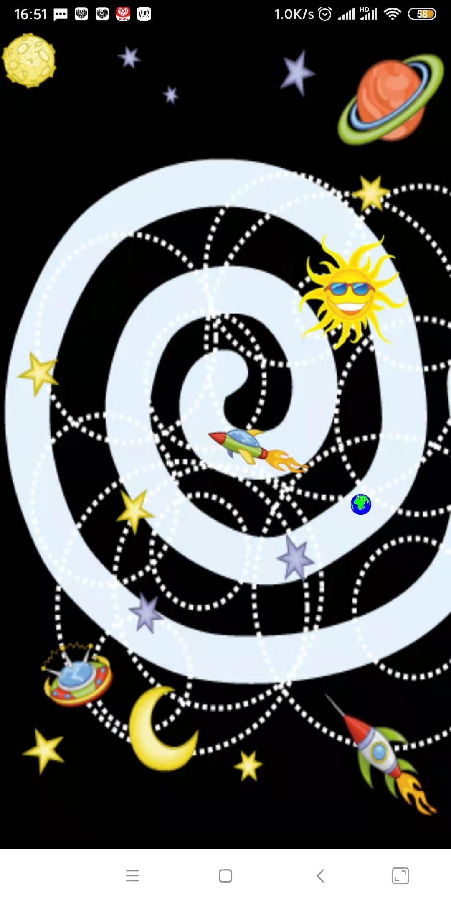

# Cartoon spaceship first edition

#### Introduction
Cartoon Spaceship First Edition: Function: The earth rotates around the sun, and the top fly can be dragged.
Hand training app written in 2013

#### Features:

1. Press and hold the vibration, release the vibration.
   Click the tip:
   This is the star,
   The moon is the moon
   Bright stars are stars closer to the earth.
   Dark stars are stars far away from the earth.
   Jupiter

   The outer frame of the polling element lights up to indicate.

   Drag the spaceship to the moon to unlock. Can be set. When you hold down the spaceship, the target point should light up

##### Draggable pictures

